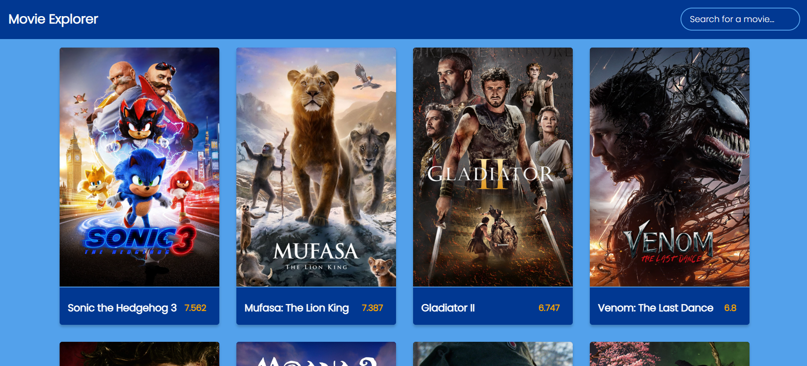
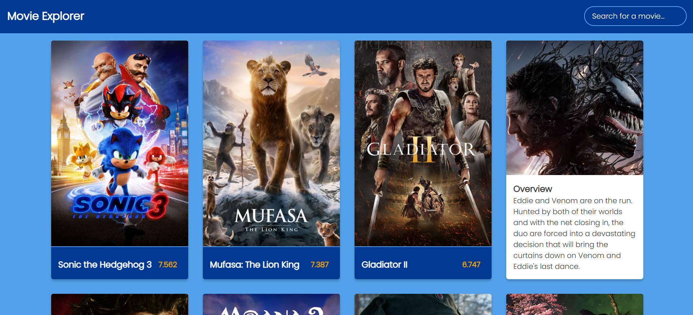

# Movie Explorer (Basic)

This project is a movie exploration web app that allows users to explore popular movies, search for specific films, and view movie ratings and overviews. It fetches data from The Movie Database (TMDb) API and displays it with a clean, animated interface.

## Technologies Used

- **HTML**: Used for the basic structure of the web app.
- **CSS**: Used for styling the app with animations and a responsive design.
- **JavaScript**: Used to handle the dynamic content and interactions.
- **The Movie Database (TMDb) API**: Provides the movie data (such as movie details, ratings, and overviews).

## Demo

Check out the demo video of the Movie Explorer:
[Movie Explorer Demo Video](./assets/movie-app-demo.mp4)

## Screenshots




## Features

- **Search for a movie...**: Users can search for a specific movie and retrieve relevant results.
- **Movie Animations**: Hover over movie posters to reveal more information with smooth animations.
- **Movie Information**: Displays details such as the movie title, poster, rating, and overview.

## Installation

To get the project up and running locally:

1. **Clone the Repository**:
   ```bash
   git clone https://github.com/batux4n/movie-app.git

Open the index.html file in your browser to view the application.

Contributing
Feel free to fork the repository and submit a pull request if you'd like to contribute to the project.

## License
This project is licensed under the MIT License - see the [LICENSE](./LICENSE) file for details.
